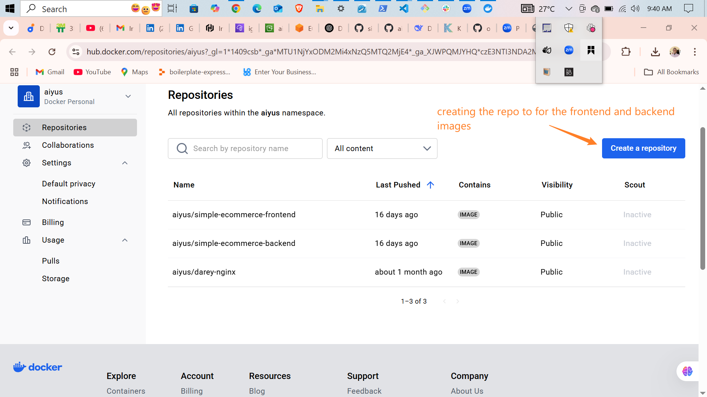
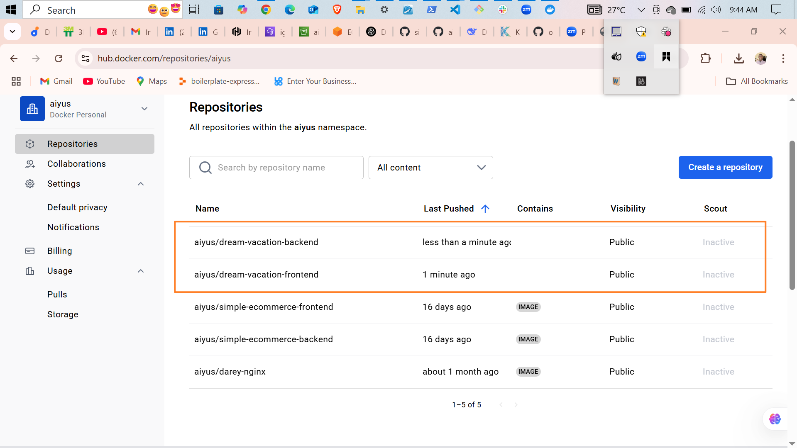
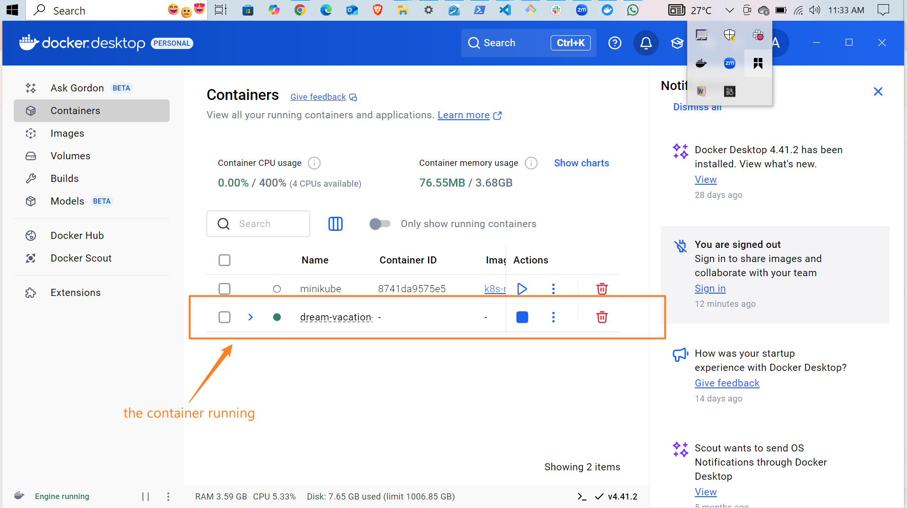
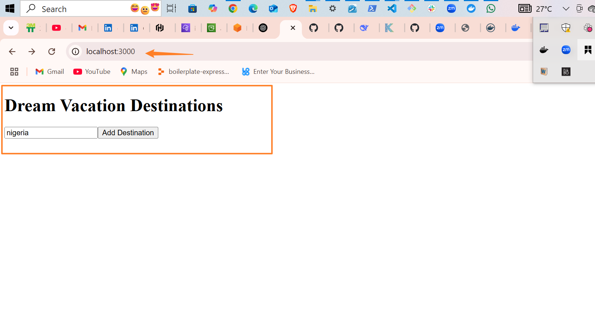
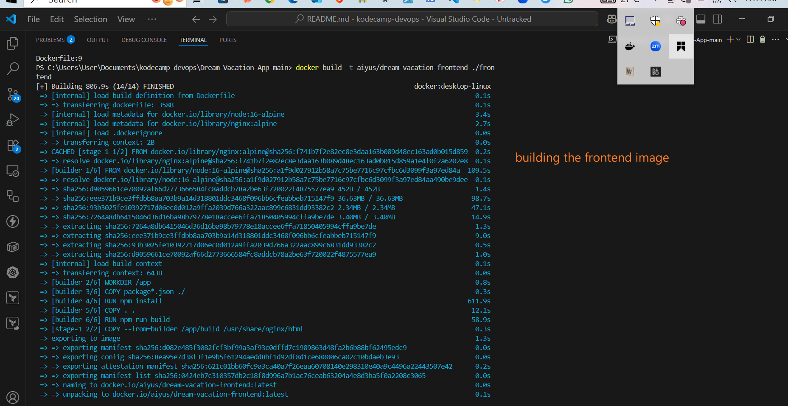
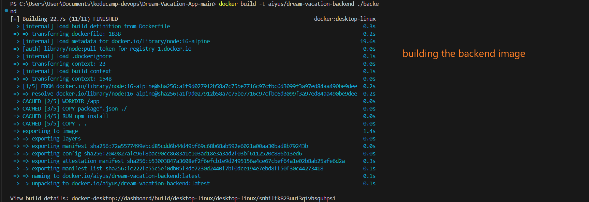
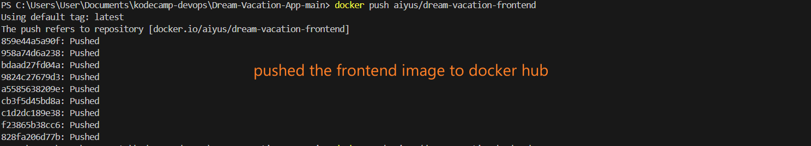
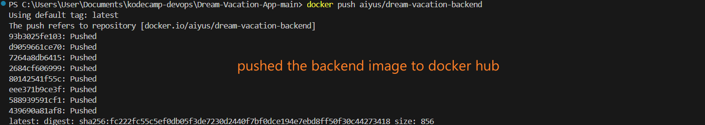
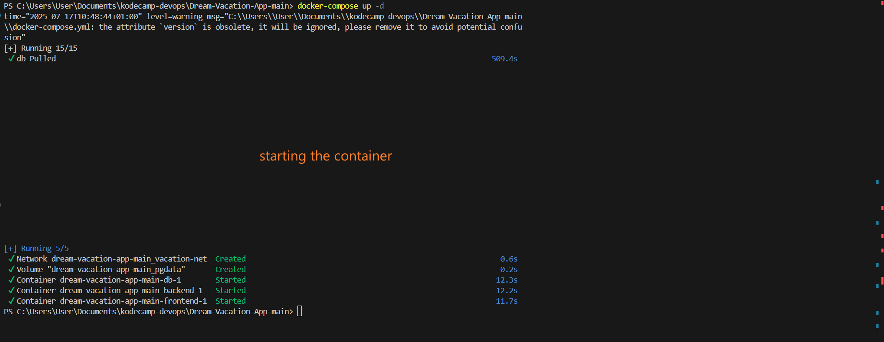

# Dream Vacation App – Dockerized 🌍🐳

This project focuses on the **containerization of a full-stack application** using Docker and Docker Compose. The app is made up of:

- A React frontend  
- A Node.js backend  
- A PostgreSQL database

---

## 🛠️ What Was Done

- The **frontend and backend code** was already provided. here [code](https://github.com/obusorezekiel/Dream-Vacation-App)
- I wrote the `Dockerfile` for both the **frontend** and **backend**.
- I created the `docker-compose.yml` file to orchestrate all services.
- I created a `.env` file for managing environment variables.
- A `.gitignore` file was added to prevent the `.env` file from being pushed, as it contains sensitive data like database credentials.
- Create a repository for each service:
    *dream-vacation-frontend*
    *dream-vacation-backend*
 



- I built and pushed the **Docker images** to **Docker Hub**.

```bash
docker build -t aiyus/dream-vacation-frontend ./frontend
docker build -t aiyus/dream-vacation-backend ./backend
docker aiyus/dream-vacation-frontend
docker aiyus/dream-vacation-backend

```
- I started the containers using:

```bash
docker-compose up  -d
```


- Assessed/viewed the frontend 



---
## Terimal Screen Shots
  
  
  
  
 


## 📦 Project Structure

```
Dream-Vacation-App/
│
├── frontend/           # React app
│   └── Dockerfile      # Multi-stage build with Nginx
│
├── backend/            # Node.js + Express API
│   └── Dockerfile      # Runs on Node 16/18
│
├── .env                # Environment variables (NOT pushed to GitHub)
├── .gitignore          # Ignores .env and node_modules
├── docker-compose.yml  # Orchestrates services
└── README.md
```


## 🚀 Usage

### 1. Clone the repo

```bash
git clone https://github.com/your-username/Dream-Vacation-App.git
cd Dream-Vacation-App
```

### 2. Create a `.env` file at the root:

```env
POSTGRES_DB=vacation_db
POSTGRES_USER=postgres
POSTGRES_PASSWORD=secret123
DB_HOST=db
DB_PORT=5432
PORT=5000
```

### 3. Start the application

```bash
docker-compose up --build
```

* Frontend: [http://localhost:3000](http://localhost:3000)
* Backend: [http://localhost:5000](http://localhost:5000)
* PostgreSQL: localhost:5432

---

## 📤 Pushed Docker Images

* **Frontend**: `docker.io/your-username/dream-vacation-frontend`
* **Backend**: `docker.io/your-username/dream-vacation-backend`

---

## ✅ Features

* Multi-stage builds for frontend optimization
* Separate services for clean separation of concerns
* Environment configuration via `.env`
* PostgreSQL data persistence using Docker volumes
* Ready for local or production Docker deployment

---


