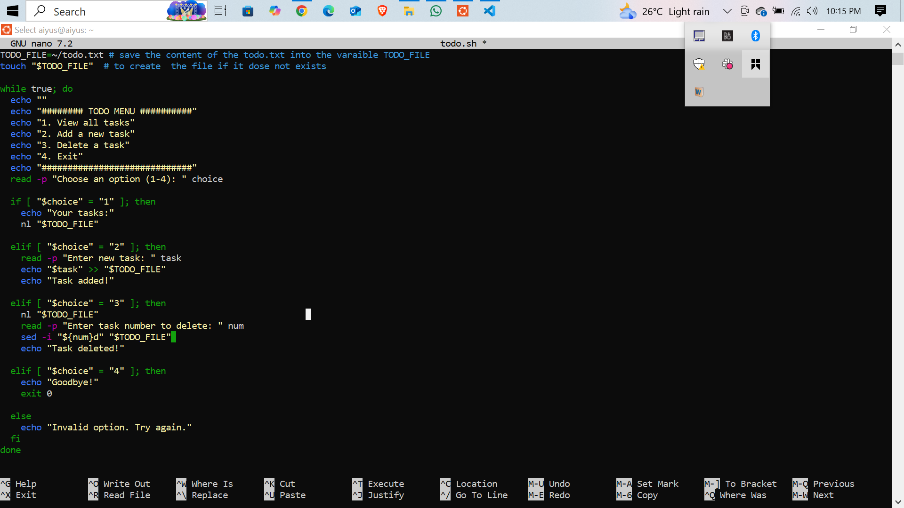
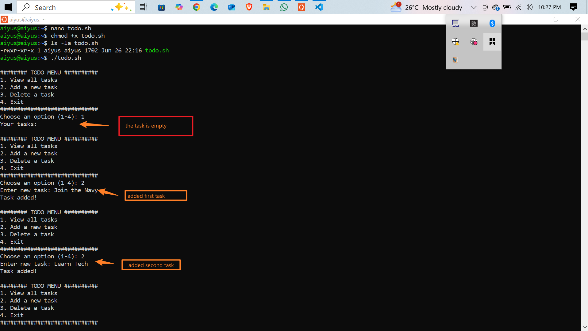
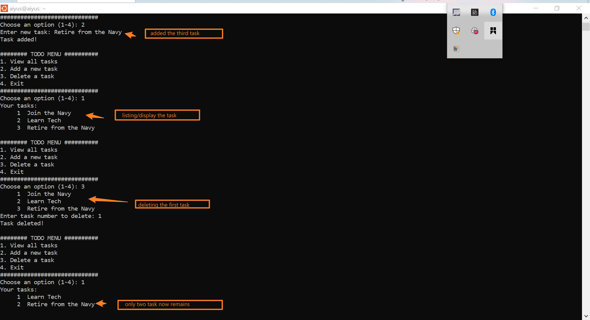
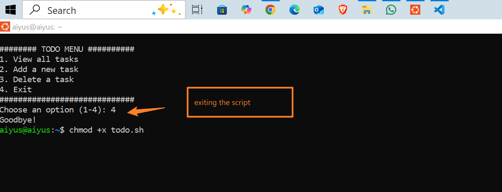

# ✅ Bash Todo List Script

## Project Overview
This is a simple Bash script (todo.sh) that allows users to manage tasks from the terminal. You can add, view, and delete tasks. Tasks are saved in ~/todo.txt.

📌 Features
- View all saved tasks

- Add a new task

- Delete a task by number

- Exit the program

- All tasks are stored persistently in a text file

## Screen Shot

  
---
 
---
  
---
 
---
### 🧾 Brief Explanation of the Script

The `todo.sh` script is a **Bash-based terminal application** that allows users to manage a simple to-do list. Here's what it does:

1. **Creates a file** named `todo.txt` in the user's home directory if it doesn't already exist.
2. **Displays a menu** with four options:

   * View all tasks
   * Add a new task
   * Delete a task
   * Exit the program
3. Based on the user’s input:

   * Option 1 displays the list of tasks using `nl` to number each task.
   * Option 2 prompts the user to enter a new task and appends it to `todo.txt`.
   * Option 3 shows the numbered task list, then lets the user delete a task by its number using `sed`.
   * Option 4 exits the script using `exit 0`.

The script uses basic commands like `read`, `echo`, `nl`, `sed`, and a `while` loop to keep the menu running until the user chooses to exit.

---
**script here** [script](./todo.sh)

